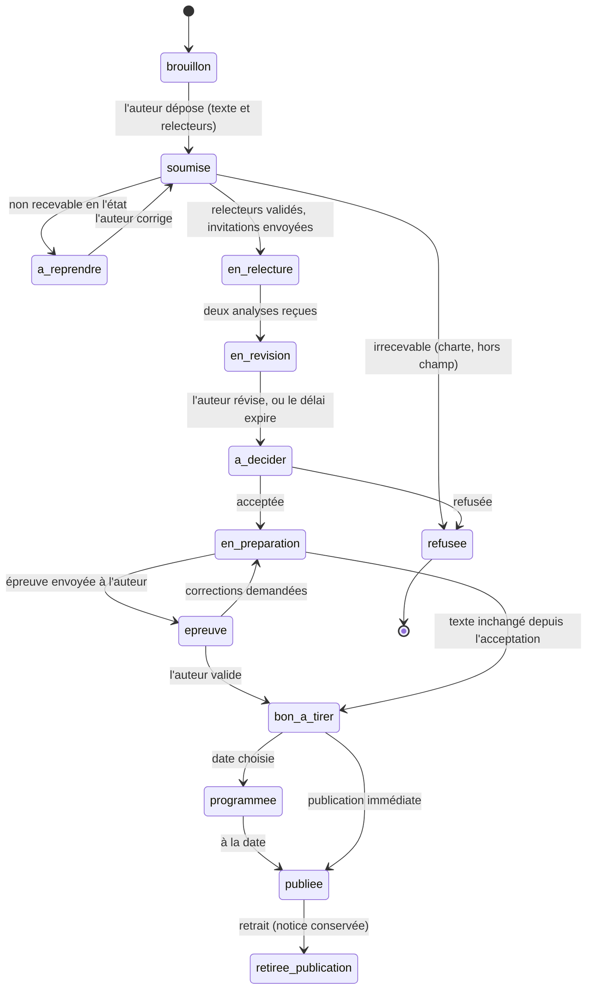

# Plan — KOHOP : publication relue par les pairs, validée par la rédaction

**Date** : 2 octobre 2026
**Statut** : proposition à valider. Ce document ne modifie aucun code.
**Demande** : « Une personne qui écrit une courte publication doit pouvoir la
faire relire par ses pairs, comme dans une maison d'édition. Un super admin ou
un éditeur valide l'article avant sa publication. »
**Sources** :

- la plaquette client *La démocratie a besoin d'un réseau* (pages 4 à 8) ;
- le code de `main` au commit `ef9af4d` ;
- `docs/backlog/editorial.md` (F-43), `docs/backlog/communaute.md` (Tribune) et
  `docs/moderation-ia.md`.

---

## Synthèse

- **Ce que veut le client.** Sur KOHOP, chaque contribution compte de 500 à
  1 000 mots. L'auteur choisit lui-même ses relecteurs. Il n'y a pas
  d'anonymat : les noms des relecteurs et leurs analyses sont publiés avec le
  texte. Un rédacteur en chef écarte les relecteurs trop proches de l'auteur,
  puis décide de la publication. Deux avis positifs valent presque acceptation.
  Les textes appartiennent à leurs auteurs. La lecture est libre et gratuite.
  Pour publier, il faut être adhérent.
- **Ce qui existe déjà.** Trois circuits, et aucun ne fonctionne ainsi :
  1. **Le dépôt en bibliothèque** : un PDF, validé par un modérateur. Si un
     administrateur active le mode `auto` de l'IA, il peut être publié par
     l'IA.
  2. **La revue à comité F-43**, livrée le 27/09. Elle fait l'inverse de KOHOP
     sur trois points : elle est en double aveugle, l'éditeur choisit les
     relecteurs, et ceux-ci sont pris dans l'équipe du site.
  3. **La Tribune** : des billets courts, modérés avant publication, sans
     relecture par des pairs.
- **Ce que nous proposons.** Une chaîne éditoriale propre à KOHOP, sur le
  modèle d'une maison d'édition. Elle enchaîne le dépôt, la vérification de
  recevabilité, la relecture ouverte, la révision, la décision, la préparation
  de copie, le bon à tirer et la parution.
  - Elle est construite **à côté** des circuits existants. Ainsi, aucun d'eux ne
    peut publier une contribution KOHOP par erreur. Ce risque est réel : la revue
    F-43 peut aujourd'hui être contournée (§ 2.3).
  - Elle réutilise leurs briques : versions, échéances et relances, déclaration
    de conflit d'intérêts, notifications, journal d'audit, e-mail, recherche.
- **Ce que garantit la chaîne.** Rien n'est publié sans l'action d'un compte
  `editeur` ou `admin`. L'IA ne publie jamais une contribution KOHOP.
- **Calendrier.** Il faut 5 à 7 semaines pour qu'une contribution aille du
  dépôt à la publication. Le lancement est prévu fin novembre ou début
  décembre. Pour avoir des textes en ligne à cette date, il faut :
  - ouvrir un pilote aux premiers auteurs vers le **26 octobre** ;
  - construire la suite de la chaîne pendant que leurs textes sont en
    relecture (§ 5).
- **À trancher cette semaine** : les décisions D-1 à D-7 (§ 6).

---

## 1. Ce que la plaquette demande

| #    | La plaquette dit | Exigence pour la plateforme | Page |
|------|------------------|-----------------------------|------|
| K-01 | « Courtes : 500 à 1 000 mots » | Texte de 500 à 1 000 mots, compté pendant la saisie et vérifié par le serveur | 5, 6 |
| K-02 | « avec des liens vers des textes plus nourris, disponibles en un clic » | Rubrique « Pour aller plus loin » : liens externes ou documents de la bibliothèque | 6 |
| K-03 | « Il désigne ses relecteurs » ; « des pairs, désignés par les contributeurs eux-mêmes » | L'auteur propose ses relecteurs, y compris des personnes extérieures au réseau | 5, 6 |
| K-04 | « Pas d'anonymat : leurs noms et leurs analyses sont publiés avec son texte » | Relecture ouverte : analyses signées, publiées avec le texte | 6 |
| K-05 | « Le rédacteur en chef veille […] peut récuser un relecteur trop proche de l'auteur, par exemple un coauteur » | Validation des relecteurs par la rédaction, récusation motivée, alertes de conflit d'intérêts | 6 |
| K-06 | « L'auteur révise — 2 semaines […] décide d'en tenir compte ou non » | Révision libre, en 14 jours, avec une réponse aux relecteurs | 6 |
| K-07 | « Il accepte ou refuse la publication. Deux avis positifs valent presque automatiquement acceptation, sauf outrance évidente ou infraction à la charte » | Décision prise par un humain. Deux avis positifs créent une présomption d'acceptation. Refuser malgré tout n'est possible que pour l'un des deux motifs cités | 6 |
| K-08 | Demande du 02/10 : « un super admin ou un éditeur devra valider l'article avant sa publication » | Aucune mise en ligne sans action d'un compte `editeur` ou `admin`. Jamais par l'IA | — |
| K-09 | « Les textes publiés appartiennent aux contributeurs, pas à la plateforme » | L'auteur garde ses droits et accorde une licence de diffusion non exclusive. Il donne son bon à tirer sur toute retouche | 6 |
| K-10 | « Gratuit et en libre accès pour les lecteurs » | Lecture sans compte ; jamais réservée aux membres | 6 |
| K-11 | « Publier sur KOHOP suppose d'adhérer au réseau » | Dépôt réservé au rang `membre` et au-dessus | 6 |
| K-12 | « Le dispositif élargit vite le cercle des « familiers » du réseau » | Relecteurs invités par e-mail, avec un compte léger, puis invités à rejoindre le réseau | 6 |
| K-13 | « Bilingue, bientôt multilingue » | Contributions en français ou en anglais au lancement ; traductions ensuite | 6 |
| K-14 | « favoriser les idées les plus significatives, les plus utiles et les plus innovantes » | Critères de relecture écrits noir sur blanc (guide du relecteur) | 5 |
| K-15 | « vocation à devenir des objets de recherche » | Citation, identifiant pérenne, versions conservées, métadonnées savantes | 4 |
| K-16 | « Un champ immense » : 10 champs, de l'éducation aux transitions démocratiques | Classement thématique (décision D-6) | 4 |
| K-17 | « diversité géographique, culturelle et de genre » ; « attentif à l'Afrique et à l'Europe » | Indicateurs de suivi (§ 8) | 3, 4 |
| K-18 | « L'adhésion passe par la signature d'une courte charte » | Charte éditoriale acceptée au dépôt, version et date conservées | 8 |

---

## 2. Le point sur l'existant

### 2.1 Trois circuits, dont aucun ne correspond à KOHOP

| | Dépôt en bibliothèque (F-32) | Revue à comité (F-43) | Tribune (F-44 à F-50) |
|---|---|---|---|
| **Ce qu'on publie** | Un PDF et son résumé | Ce même dépôt, évalué | Un billet court (≤ 10 000 caractères) ou une analyse (≤ 20 000) |
| **Où le texte est écrit** | Hors plateforme (le fichier) | Idem | Dans la plateforme, en texte brut |
| **Qui choisit les relecteurs** | — | L'éditeur, parmi l'équipe (rang `moderateur` et au-dessus) | — |
| **Anonymat** | — | Double aveugle : copie PDF anonymisée, avis numérotés | — |
| **Qui décide** | Un modérateur, ou l'IA en mode `auto` | Un éditeur | Un modérateur, ou l'IA si l'option est cochée |
| **Avis publiés avec le texte** | — | Non | — |
| **Délais** | — | 21 jours pour le relecteur, avec relances. Aucun délai pour l'auteur | — |
| **Code** | `convex/publications.ts` | `convex/peerReview.ts`, `convex/lib/manuscripts.ts` | `convex/tribune.ts`, `convex/communityModeration.ts` |
| **Écrans** | `/espace-membre/deposer`, `/espace-membre/publications`, `/admin/publications` | `/espace-membre/manuscrits`, `/admin/revue`, `/admin/mes-relectures` | `/tribune`, `/espace-membre/contributions`, `/admin/file-moderation` |

### 2.2 Écarts avec la plaquette

| Exigence | Ce qui existe | Écart |
|---|---|---|
| K-01 Longueur en mots | Aucun comptage de mots. Les limites sont toutes en caractères | ❌ |
| K-02 Liens « en un clic » | Rien, ni dans la bibliothèque ni dans la Tribune | ❌ |
| K-03 L'auteur désigne ses relecteurs | Dans F-43, c'est l'éditeur qui les désigne | ❌ |
| K-04 Relecture ouverte | F-43 fonctionne en double aveugle. Les avis ne sont jamais publiés | ❌ |
| K-05 Récusation par le rédacteur en chef | F-43 permet seulement au relecteur de déclarer lui-même un conflit d'intérêts. Pas d'alertes automatiques | ⚠ partiel |
| K-06 Révision en 2 semaines | F-43 gère les versions et la lettre de réponse, mais l'auteur n'a pas de délai | ⚠ partiel |
| K-07 Décision et règle des deux avis | F-43 impose une décision motivée, mais pas de présomption. Son échelle d'avis est différente : accepter / mineure / majeure / rejeter | ⚠ partiel |
| K-08 Validation par un éditeur | Bibliothèque : un modérateur publie, et le mode IA `auto` peut publier seul. F-43 : publication par un éditeur ✅ | ❌ |
| K-09 Droits des auteurs | Pas de licence recueillie au dépôt, pas de bon à tirer | ❌ |
| K-10 Libre accès | La bibliothèque propose un accès réservé aux membres | ⚠ à fermer pour KOHOP |
| K-11 Réservé aux adhérents | `requireNetworkRole(ctx, 'membre')` partout | ✅ |
| K-12 Relecteurs extérieurs | Le relecteur doit avoir le rang `moderateur`. Aucun e-mail de relecture. Pas d'inscription libre : `NO_SELF_SIGNUP` | ❌ |
| K-13 Bilingue | Interface en 5 langues (fr, en, es, pt, ar, avec le sens de lecture droite-à-gauche pour l'arabe). La traduction automatique existe pour ce qui est publié | ✅ réutilisable |
| K-15 Objet de recherche | Citations APA, BibTeX et RIS dans la bibliothèque. Le « DOI » affiché n'est enregistré nulle part (§ 2.3) | ⚠ |
| K-18 Charte acceptée au dépôt | La Tribune a un code de conduite. Il n'existe pas de charte éditoriale acceptée au dépôt | ❌ |

### 2.3 Points d'attention relevés pendant l'audit

Les trois premiers points sont des défauts actuels. Ils valent d'être corrigés
même sans KOHOP.

| # | Constat | Où | Proposition |
|---|---|---|---|
| A-1 | **La revue F-43 peut être contournée.** Un manuscrit en relecture garde le statut `pending` et reste dans `/admin/publications`. Sur cet écran, le bouton « Approuver » (rang modérateur) le publie, avec le fichier d'origine. Le serveur ne vérifie pas `reviewStage`. L'IA en mode `auto` non plus : elle ne regarde que `status`. | `publications.reviewPublication`, `aiModeration.applyVerdict`, `admin/publications/page.tsx` | Refuser la modération et l'auto-publication tant qu'une revue est en cours (lot 0) |
| A-2 | **Le « DOI » affiché n'en est pas un.** `10.59000/dt.<slug>` apparaît dans la bibliothèque et le baromètre, avec un lien `doi.org`. Aucun de ces DOI n'est enregistré : doi.org répond « introuvable ». Le préfixe 10.59000 est un vrai préfixe Crossref, attribué en octobre 2022, et rien ne le rattache à l'association. | Attribution : `publications.ts`, `peerReview.ts`, `aiModeration.ts`. Affichage : `bibliotheque/[slug]/page.tsx`, `src/lib/barometer-content.ts` | Afficher un lien permanent au lieu d'un DOI tant qu'aucun n'est enregistré (lot 0, décision D-12) |
| A-3 | **Un modérateur publie dans la bibliothèque**, et le mode IA `auto` (éteint par défaut) le peut aussi. Les deux vont contre K-08 si la règle s'applique aussi à la bibliothèque. | `reviewPublication` (rang `moderateur`), `/admin/moderation-ia` | Passer la décision au rang `editeur` et exclure les dépôts du mode `auto` (lot 0, décision D-7) |
| A-4 | **La revue n'envoie aucun e-mail.** Les relances sont de simples notifications sur le site. Un relecteur extérieur ne les verrait jamais. | `peerReview.sendDueReminders` | Prévoir des e-mails dès la conception de KOHOP (§ 4.6) |
| A-5 | **Les mots se mélangent.** « Mes contributions » désigne déjà les billets de la Tribune, alors que la plaquette appelle « contributions » les textes KOHOP. Après un dépôt, le message de succès renvoie à « Mes contributions », alors que l'écran s'appelle « Mes publications ». Il annonce aussi « vous pourrez l'ajouter plus tard », alors qu'aucun écran ne permet d'ajouter le fichier ensuite. | `member-nav.ts`, `publication-submit-form.tsx`, `src/messages/*.json` | Fixer le vocabulaire (annexe A) et corriger les deux messages (lot 0) |
| A-6 | **Deux informations de la fiche publique sont vides ou figées.** La licence n'est jamais renseignée pour un dépôt. Le compteur de citations ne vient que des données de démonstration. | `submitPublication`, `bibliotheque/[slug]` | KOHOP recueille la licence au dépôt. Le compteur est à revoir plus tard |
| A-7 | **L'annuaire d'experts repose sur des noms en texte libre.** Deux homonymes sont fusionnés, et aucune entrée n'est reliée à un compte. | `convex/experts.ts` | KOHOP fournira des auteurs et relecteurs reliés à de vrais comptes (lot 7) |

---

## 3. Le modèle cible : une chaîne de maison d'édition

### 3.1 Qui fait quoi

| Dans une maison d'édition | Dans KOHOP | Sur la plateforme |
|---|---|---|
| Auteur | Contributeur, ou auteur correspondant s'il y a plusieurs auteurs | Rang `membre` ou au-dessus (K-11) |
| Coauteurs | Coauteurs : nom et affiliation | Listés. Ils n'ont pas besoin d'être inscrits |
| Comité de lecture | Relecteurs désignés par l'auteur | Toute personne invitée par e-mail et validée par la rédaction. Elle n'accède qu'à **sa** relecture |
| Rédacteur en chef | Rédacteur en chef | Rang `editeur` ou `admin` : recevabilité, relecteurs, décision, parution |
| Éditeur, secrétaire de rédaction | Éditeur en charge (facultatif) et préparation de copie | Rang `editeur` |
| Directeur de la publication | Responsable légal du site | Déjà prévu dans les mentions légales. Le nom reste à fournir (`src/lib/legal-content.ts`) |
| — | Modérateur | Aucun droit sur KOHOP. Il garde la Tribune |

### 3.2 La chaîne, étape par étape

La plaquette décrit cinq étapes. Une maison d'édition en ajoute trois :
vérifier que le texte est recevable avant de le faire relire, préparer la
copie et faire valider l'épreuve, puis gérer la parution et la vie du texte
publié.

L'auteur peut **retirer** sa contribution à toute étape avant la parution :
elle passe alors à l'état final « retirée ». Ce cas n'est pas dessiné ici.

| Étape (code) | Qui agit | Délai | Sorties possibles |
|---|---|---|---|
| ① Brouillon (`draft`) | Auteur | — | Dépôt, ou abandon |
| ② Soumise : recevabilité (`submitted`) | Rédaction | Objectif : 5 jours ouvrés | Lancer la relecture (au moins 2 relecteurs validés), renvoyer à l'auteur, ou déclarer irrecevable |
| ②bis À reprendre (`returned`) | Auteur | 14 jours | Nouveau dépôt, ou retrait |
| ③ En relecture (`in_review`) | Relecteurs | 5 jours pour répondre à l'invitation, puis 14 jours pour l'analyse | Deux analyses reçues → révision. Si un relecteur se désiste ou est récusé, il est remplacé |
| ④ En révision (`revision`) | Auteur | **14 jours** (K-06) | Dépôt de la version révisée. À l'échéance, la version relue passe à la décision |
| ⑤ À décider (`decision`) | Rédacteur en chef | Objectif : 7 jours | Acceptée, ou refusée |
| ⑥ En préparation (`production`) | Rédaction | — | Envoi de l'épreuve, ou bon à tirer direct si rien n'a changé |
| ⑥bis Épreuve (`proof`) | Auteur | 5 jours | Bon à tirer, ou demande de corrections |
| ⑦ Bon à tirer (`ready`), puis programmée (`scheduled`) | Rédaction | Date choisie | Publiée |
| ⑧ Publiée (`published`) | — | — | Retrait avec notice (exceptionnel) |
| États finaux | — | — | Refusée (`refused`), retirée par l'auteur (`withdrawn`), retirée après publication (`retracted`) |

### 3.3 Les règles

#### Relecteurs (K-03, K-04, K-05, K-12)

- **Combien.** L'auteur désigne **deux relecteurs et un suppléant**. Le
  suppléant est conseillé, pas obligatoire. Il n'est invité que si une place se
  libère : désistement, récusation ou délai dépassé. Il y a donc toujours deux
  relecteurs actifs, sans attendre une nouvelle désignation.
- **Ce que l'auteur fournit pour chacun** : nom, e-mail, affiliation, un lien
  public qui atteste son identité ou son expertise (page institutionnelle,
  ORCID…), la raison de ce choix, et le lien éventuel avec l'auteur.
- **Aucun e-mail ne part avant la validation de la rédaction.** Cela protège à
  la fois contre le spam, pour le respect du RGPD (données de tiers) et contre
  les conflits d'intérêts.
- **Refus bloquants, vérifiés par le serveur** : l'auteur lui-même, un coauteur
  du texte, la même personne désignée deux fois.
- **Alertes signalées à la rédaction, qui tranche** :
  - même organisation que l'auteur ;
  - adresse sur le domaine de l'organisation de l'auteur ;
  - adresse de messagerie grand public (identité à vérifier) ;
  - réciprocité : l'auteur a relu cette personne dans les 12 derniers mois ;
  - récurrence : la personne a déjà été désignée deux fois par le même auteur en
    12 mois.
- **Récusation.** La rédaction peut récuser un relecteur à tout moment, avec un
  motif : coauteur, même institution, lien personnel ou hiérarchique, expertise
  insuffisante, identité non vérifiée, autre. L'auteur propose alors un
  remplaçant, sauf si un suppléant est déjà validé. L'analyse d'un relecteur
  récusé n'est jamais publiée.
- **Invitation.** Elle arrive par e-mail, avec un lien. On peut accepter ou
  décliner sans avoir de compte, et proposer quelqu'un d'autre en déclinant.
  - Pour écrire l'analyse, on se connecte avec un code envoyé à **l'adresse
    invitée**. Un lien transféré à quelqu'un d'autre ne lui sert donc à rien.
    C'est indispensable, puisque le nom du relecteur sera publié.
- **Avant de lire le texte**, le relecteur déclare qu'il n'a pas de conflit
  d'intérêts. Il accepte aussi que son nom, son affiliation et son analyse
  soient publiés sous licence. C'est une condition pour relire, puisque la
  relecture n'est pas anonyme.
- **Ce que le relecteur rend** :
  - un avis à trois niveaux, repris de F1000Research : **Favorable**,
    **Favorable avec réserves**, **Défavorable** ;
  - une analyse publique, guidée par cinq critères : pertinence, originalité,
    rigueur, clarté, utilité ;
  - s'il le souhaite, une note confidentielle à la rédaction. Elle n'est jamais
    publiée et sert aux questions d'éthique : soupçon de plagiat, conflit
    découvert en cours de lecture.
- **Délais et relances.** Le relecteur a 5 jours pour répondre à l'invitation
  et 14 jours pour rendre son analyse. Il reçoit un rappel 3 jours avant
  l'échéance, puis une relance le jour même et tous les 3 jours, trois relances
  au plus. Ensuite, la rédaction et l'auteur sont prévenus, et le suppléant
  prend le relais.

#### Révision (K-06)

- Dès que les deux analyses sont reçues, l'auteur les lit, avec les noms des
  relecteurs, et dispose de **14 jours**.
- Il peut réviser son texte : une nouvelle version est créée et l'ancienne est
  conservée. Il peut aussi le laisser tel quel. Dans les deux cas, il rédige
  une **réponse aux relecteurs**, publiée avec les analyses (décision D-9).
- Il est relancé 3 jours avant l'échéance, puis le jour même. À l'échéance, la
  version relue passe à la décision telle quelle, et l'auteur en est informé.
  S'il en fait la demande, la rédaction peut accorder une prolongation.

#### Décision (K-07, K-08)

- **Deux avis positifs** (favorable, ou favorable avec réserves) créent une
  **présomption d'acceptation**. L'écran l'affiche, et « Accepter » est
  présélectionné.
- **Refuser malgré cette présomption** exige l'un des deux motifs de la
  plaquette, « outrance évidente » ou « infraction à la charte », et une
  justification écrite. La justification est envoyée à l'auteur. Le journal
  d'audit signale ce cas à part.
- **Si les avis sont partagés**, le rédacteur en chef tranche librement, avec
  un motif. Un troisième avis pour départager pourra être ajouté plus tard.
- **Toute décision est prise par une personne** ayant le rang `editeur` ou
  `admin`. L'IA ne décide jamais pour KOHOP.

#### Préparation de copie et bon à tirer (K-09)

- **La préparation de copie** corrige les coquilles, ajuste le titre, le chapô
  et les intertitres, et vérifie les liens. Chaque retouche crée une version,
  dont les différences avec la précédente sont visibles.
- **Le bon à tirer.** Si le texte a changé depuis l'acceptation, l'auteur doit
  valider l'épreuve finale (5 jours) avant toute parution : c'est la
  conséquence directe de « les textes appartiennent aux contributeurs ». Si
  rien n'a changé, la rédaction peut publier la version acceptée.

#### Parution et vie du texte

- La publication est **immédiate ou programmée**, selon un calendrier
  éditorial.
- Le contenu de la page publique est décrit au § 3.4.
- **Retrait après publication** (exceptionnel, rang `editeur` et au-dessus,
  avec un motif). La page reste en ligne avec une notice datée, et le texte
  n'est plus affiché. C'est ce qu'il faut pour une demande légale. La suppression
  silencieuse n'existe pas.
- **Plus tard** : errata versionnés, et rétractation sur le modèle des
  recommandations du COPE (*Committee on Publication Ethics*).

### 3.4 Ce que voit le lecteur

Une page `/kohop/<slug>`, lisible sans compte (K-10), contient :

1. **L'en-tête** : champ thématique, titre, chapô, auteurs (avec leur
   affiliation et un lien vers la fiche de leur organisation), date, temps de
   lecture, langue.
2. **Le texte.**
3. **« Pour aller plus loin »** : les liens de l'auteur, accessibles en un clic
   (K-02).
4. **« Évaluation par les pairs »** :
   - le parcours daté : soumise le…, relue par…, révisée le…, acceptée le…,
     publiée le… ;
   - une carte par relecteur : nom, affiliation, avis, analyse, date, et la
     version évaluée ;
   - la réponse de l'auteur ;
   - l'accès à la version soumise à la relecture.
5. **Les droits et la citation** : « © les auteurs — CC BY 4.0 » (décision
   D-8), et la citation en APA, BibTeX et RIS. Les fonctions qui produisent ces
   citations dans la bibliothèque sont réutilisées. S'y ajoute l'identifiant
   pérenne (décision D-12).
6. **Les métadonnées savantes** : schema.org `ScholarlyArticle`, balises
   `citation_*` lues par Google Scholar, plan du site, recherche globale.

### 3.5 Ce que nous empruntons aux éditeurs et aux revues

| Pratique | Origine | Dans KOHOP |
|---|---|---|
| Vérifier la recevabilité avant toute relecture, et pouvoir refuser d'emblée | Revues, maisons d'édition | Contrôle du format et de la charte avant de solliciter qui que ce soit |
| Rapport de lecture signé et publié | Revues à relecture ouverte (F1000Research, BMJ) | Analyses nominatives, publiées avec le texte |
| Relecteurs suggérés par l'auteur, sous contrôle éditorial | F1000Research. Leçon des « fausses relectures » de 2012 à 2015 : des auteurs avaient suggéré des relecteurs dont ils contrôlaient l'adresse, et des dizaines d'articles ont été rétractés chez plusieurs éditeurs | Validation avant toute invitation, identité vérifiée par l'adresse invitée, alertes |
| Lettre de réponse aux relecteurs | Revues | Réponse de l'auteur, publiée |
| Épreuve et bon à tirer | Édition | L'auteur valide le texte final |
| Calendrier de parution | Presse, édition | Publication programmée |
| Erratum, rétractation | Revues, recommandations du COPE | Retrait avec notice dès le lancement, errata ensuite |
| Guide de l'auteur, guide du relecteur | Revues | Deux pages, rappelées dans les formulaires |
| ISSN | Publications en série | ISSN de publication en ligne, gratuit auprès du Centre ISSN France (BnF). À étudier (D-12) |
| DOI | Revues | Crossref ou Zenodo / DataCite (décision D-12) |

---

## 4. Architecture technique

### 4.1 Pourquoi une chaîne séparée des circuits existants

- **On n'étend pas F-43, car chacune de ses règles est l'inverse de celles de
  KOHOP :**
  - ses relecteurs doivent avoir le rang `moderateur` ;
  - le double aveugle est imposé dans les sept requêtes accessibles au
    relecteur, et vérifié par des tests ;
  - le manuscrit est un PDF ;
  - c'est l'éditeur qui assigne les relecteurs ;
  - les avis restent confidentiels.

  Ajouter un « mode » qui ferait bifurquer chaque requête multiplierait les
  risques de fuite d'informations et de contournement.
- **On n'étend pas non plus `publications` ou `tribunePosts`.** Leurs files de
  modération publient toute ligne en attente, que la décision vienne d'un
  modérateur ou de l'IA. Il faudrait ajouter une garde à chaque point d'entrée,
  et il suffirait d'en oublier une pour publier un texte sans relecture. A-1
  montre que cela s'est déjà produit avec F-43.
- **Avec des tables à part, ce contournement est impossible par construction** :
  aucune mutation existante ne connaît ces tables.
- **Ce qui est réutilisé :**
  - la machine à états pure, testée paire par paire (`convex/lib/manuscripts.ts`,
    `convex/lib/reviewState.ts`) ;
  - les versions ;
  - les échéances et relances (tâche planifiée `peer-review-reminders`, index
    `by_dueAt` qui ne contient que les relectures attendues) ;
  - la déclaration de conflit d'intérêts ;
  - `notify`, `recordAudit` et les limites de débit ;
  - la chaîne d'e-mails (`emailKit`, `emailDocument`) ;
  - l'indexation pour la recherche ;
  - les fonctions de citation ;
  - les composants d'interface shadcn.

### 4.2 Données — nouveau fichier `convex/lib/tables/kohop.ts`

| Table | Rôle | Champs principaux | Index |
|---|---|---|---|
| `kohopContributions` | Le dossier, un par contribution | `stage`, `authorUserId`, `organizationId?`, `lang`, `fields` (champs thématiques), `keywords`, `coAuthors` (≤ 10 : nom, affiliation, e-mail facultatif), `currentVersion`, `title` (copie de la dernière version, pour les listes), `slug` (fixé à l'acceptation), `handlingEditorId?`, échéances (`revisionDueAt`, `proofDueAt`, `scheduledFor`), dates (`submittedAt`, `decidedAt`, `publishedAt`, `retractedAt`), `charterVersion` et `charterAcceptedAt`, `licence`, `searchText` | `by_author`, `by_stage`, `by_slug`, `by_stage_and_publishedAt`, index de recherche `search_text` |
| `kohopVersions` | Les versions successives, jamais réécrites | `contributionId`, `version`, `kind` (soumission / révision / préparation), `title`, `standfirst` (chapô), `body` (texte balisé, § 4.5), `links` (≤ 10 : libellé, URL ou publication de la bibliothèque), `wordCount`, `responseToReviewers?`, `createdBy` | `by_contribution_and_version` |
| `kohopReviewers` | Le relecteur, de sa désignation à son analyse | `contributionId`, `slot` (titulaire / suppléant), `name`, `email` (normalisé), `affiliation`, `publicUrl`, `rationale`, `declaredRelationship`, `userId?` (relié à la connexion), `status` (`proposed`, `approved`, `recused`, `invited`, `accepted`, `declined`, `expired`, `submitted`), `flags` (alertes calculées), `recusal?`, `inviteTokenHash?`, `invitedAt`, `dueAt?` (renseigné seulement tant qu'une réponse est attendue), `remindersSent`, `conflict?`, `publicationConsentAt?` | `by_contribution`, `by_email`, `by_user`, `by_dueAt`, `by_tokenHash` |
| `kohopReviews` | L'analyse, une par relecteur | `contributionId`, `reviewerId`, `version` évaluée, `recommendation` (`favorable`, `reserves`, `defavorable`), `analysis` (publique), `noteToEditor?` (jamais publique), `displayName` et `affiliation` (figés : c'est ce qui sera publié), `submittedAt`, `updatedAt` | `by_contribution`, `by_reviewer` |
| `kohopDecisions` | Les décisions, une ligne chacune, jamais réécrites | `contributionId`, `version`, `kind` (renvoi, irrecevable, acceptée, refusée, retrait), `reasonCode?` (`outrance`, `charte`, `hors_champ`, `hors_format`, `autre`), `reason`, `positiveReviews`, `againstPresumption`, `decidedBy` | `by_contribution` |
| `kohopEvents` | L'historique : un fait par ligne, auteur et date | `contributionId`, `kind`, `actorId?`, `at`, `metadata`. Une partie (les dates) est affichée publiquement comme parcours | `by_contribution` |

Les bornes vivent dans un module pur, `convex/lib/kohop.ts`. La plateforme le
lit des deux côtés, serveur et navigateur, comme elle le fait déjà pour
`roles.ts` :

| Élément | Borne |
|---|---|
| Texte | 500 à 1 000 mots |
| Titre | 4 à 160 caractères |
| Chapô | 100 à 400 caractères |
| Mots-clés | 8 au plus |
| Liens | 10 au plus, en `https` |
| Coauteurs | 10 au plus |
| Relecteurs | 2 titulaires et 1 suppléant |
| Analyse | 150 à 1 500 mots |
| Note à la rédaction | 2 000 caractères au plus |
| Réponse aux relecteurs | 800 mots au plus |
| Délais | invitation 5 jours, analyse 14 jours, révision 14 jours, bon à tirer 5 jours |

### 4.3 La machine à états

- `KOHOP_MACHINE`, `nextStage` et `canTransition` vivent dans
  `convex/lib/kohop.ts`. Le serveur et l'écran de la rédaction lisent la même
  table, sur le modèle de `MANUSCRIPT_MACHINE`.
- **Tests purs** sur toutes les paires (étape × événement), et **tests
  convex-test** sur les vraies mutations, qui vérifient qu'une transition
  refusée n'écrit rien.
- **Invariant testé** : aucun chemin ne mène à `published` sans l'action d'un
  compte `editeur` ou `admin`. Cette action est soit `publish`, soit `schedule`
  posée par ce compte.

### 4.4 Qui peut faire quoi

- **L'auteur** passe `requireNetworkRole(ctx, 'membre')`, puis le contrôle de
  propriété (`authorUserId`). Le dossier de quelqu'un d'autre se lit comme
  inexistant.
- **Le relecteur** n'a besoin d'aucun rang. Son droit vient de sa ligne
  `kohopReviewers` : compte relié, statut accepté, adresse vérifiée égale à
  l'adresse invitée. Une nouvelle garde, `requireKohopReviewer(ctx,
  contributionId)`, le vérifie.
  - Il voit la version à évaluer, l'identité de l'auteur (la relecture est
    ouverte) et sa propre analyse.
  - Il ne voit jamais les notes confidentielles des autres relecteurs ni
    l'e-mail de l'auteur.
- **La rédaction** passe `requireNetworkRole(ctx, 'editeur')`. Les modérateurs
  n'ont aucun accès.
- **Le public** ne voit que les contributions publiées ou retirées. Comme pour
  la Tribune (issue #30), la projection est figée par des validateurs `returns` :
  - pas d'e-mail ;
  - pas de note confidentielle ;
  - pas de relecteur récusé ;
  - pas de version de travail.

  Un test sérialise chaque réponse publique et vérifie que rien de cela n'y
  figure, comme le fait le test de double aveugle de F-43.
- **Le compte du relecteur extérieur.** L'inscription libre est fermée : la
  connexion échoue avec `NO_SELF_SIGNUP` si aucune ligne `users` n'existe.
  L'acceptation de l'invitation crée donc le compte, sans rang, c'est-à-dire
  `visiteur`.
  - Elle n'est possible qu'avec un jeton valide, envoyé après validation par la
    rédaction.
  - Le jeton est aléatoire (256 bits), stocké sous forme d'empreinte SHA-256,
    expire et ne sert qu'à cela, comme les confirmations de newsletter.
  - La création est journalisée (`USER_INVITED`, `via: 'kohop'`) et limitée en
    débit.
  - La personne se connecte ensuite par code e-mail, comme un compte invité par
    un administrateur.
- **Contre l'oracle d'existence.** La réponse est la même, qu'un compte existe
  déjà ou non.

### 4.5 Le texte : format et éditeur

- **Aujourd'hui, il n'y a ni éditeur riche ni Markdown.** La Tribune et les
  actualités s'écrivent en texte brut.
- **Notre recommandation** : un sous-ensemble contraint de Markdown. Il permet
  les paragraphes, les intertitres `##` et `###`, le gras, l'italique, les
  listes, les citations et les liens `https`.
  - Il est lu par un module pur, écrit ici et partagé par le serveur et le
    navigateur.
- **Ce que ce choix apporte :**
  - un comptage de mots identique des deux côtés ;
  - un rendu en éléments React, jamais en HTML brut, donc sans risque
    d'injection de script ;
  - des différences entre versions faciles à calculer, ce qui est indispensable
    pour la révision et le bon à tirer ;
  - une indexation et une traduction faites sur du texte simple.
- **L'écran de rédaction** propose une zone de texte, une petite barre
  d'outils, un aperçu en direct, un compteur de mots (de 500 à 1 000) et une
  sauvegarde automatique du brouillon. Il fonctionne sur mobile et avec un
  faible débit (F-05).
- **Un éditeur WYSIWYG** (Tiptap) reste possible plus tard, si le client y
  tient. Il rendrait les différences entre versions plus difficiles à calculer
  et alourdirait les pages.

### 4.6 Notifications, e-mails, tâches planifiées

- **Pourquoi l'e-mail est indispensable** : le relecteur extérieur ne voit pas
  les notifications du site. Les comptes inscrits reçoivent en plus une
  notification sur le site.
- **Les modèles d'e-mail** suivent le format existant
  (`convex/lib/emailLayout.ts`). Chaque phrase y est déclarée dans les **cinq
  langues** du site, sans quoi la compilation échoue : c'est à prévoir dans les
  estimations.

| Destinataire | E-mails |
|---|---|
| Relecteur | Invitation, relance d'invitation, relance d'analyse, remerciements avec le lien vers le texte publié et une invitation à rejoindre le réseau |
| Auteur | Relecteur récusé ou qui se désiste (à remplacer), analyses reçues avec l'échéance de révision, relances de révision, décision, épreuve à valider, publication |
| Rédaction | Nouveau dépôt, relecteurs à valider, analyses complètes, révision déposée, retards |

- **Tâches planifiées :**
  - une tâche quotidienne `kohop-deadlines`, sur le modèle de
    `peer-review-reminders` : invitations sans réponse, analyses attendues,
    révisions à échéance (passage à la décision), bons à tirer en attente ;
  - la publication programmée passe par `ctx.scheduler.runAt` ;
  - les e-mails partent depuis des actions planifiées par `runAfter(0)`, puisque
    les mutations ne font pas d'appel réseau.

### 4.7 Intégrations

- **Recherche globale** : une nouvelle source, limitée aux contributions
  publiées.
- **Pages thématiques, fiches d'organisation, annuaire d'experts** : auteurs, et
  relecteurs qui ont donné leur accord.
- **Référencement** : plan du site, `canonical` et `hreflang`,
  `ScholarlyArticle`, balises `citation_*`.
- **Citation** : les fonctions de la bibliothèque (APA, BibTeX, RIS).
- **Journal d'activité** : de nouvelles actions `AUDIT.KOHOP_*`.
- **Plus tard :**
  - la traduction (nouveau type de source dans `convex/lib/translation.ts`) ;
  - le pré-examen par l'IA : des signaux sur la charte, montrés à la rédaction,
    qui ne décident jamais ;
  - la newsletter ;
  - un indicateur dans `/admin/impact`.

### 4.8 RGPD et sécurité

- **Données de tiers.** Les relecteurs sont proposés par l'auteur, sans leur
  avis. On ne collecte donc que le strict nécessaire, et aucun e-mail ne leur
  est envoyé avant la validation de la rédaction. L'invitation comporte une
  mention d'information. Les invitations déclinées, expirées ou récusées sont
  purgées au bout de 6 mois par une tâche planifiée.
- **Publication du nom et de l'analyse** : consentement explicite, sur un texte
  versionné. C'est une condition pour relire.
- **Suppression et export de compte** : `deleteUserDataKohop` et
  `exportUserDataKohop`, branchés dans `convex/lib/accountDeletion.ts` comme
  les autres modules. La règle pour les textes et analyses déjà publiés reste à
  décider (D-14).
- **Sécurité :**
  - gardes côté serveur partout ;
  - transitions uniquement par la machine à états ;
  - audit de chaque action ;
  - limites de débit sur les désignations, les invitations et les dépôts ;
  - liens externes en `rel="noopener noreferrer nofollow ugc"`.

### 4.9 Le sort des circuits existants

- **La bibliothèque** reste le lieu des documents longs, les « textes plus
  nourris » vers lesquels KOHOP renvoie. Elle s'aligne sur K-08 : la décision
  passe au rang `editeur` et l'auto-publication IA est exclue (D-7, lot 0).
- **F-43.** Les entrées « Mes manuscrits » et « Comité de lecture » sont
  masquées si le client confirme un modèle unique et ouvert (D-13). Le code
  reste en sommeil : rien n'est supprimé avant la décision.
- **La Tribune** ne change pas, sauf le libellé « Mes billets ». Plus tard, une
  analyse publiée pourra être « proposée à KOHOP » : un brouillon prérempli, à
  la place ou à côté de « Proposer à la bibliothèque ».

---

## 5. Plan d'exécution

Les estimations sont en jours de développement, tests compris. Chaque lot se
termine par `pnpm verify` au vert, ses tests (purs, convex-test, et un scénario
Playwright pour les parcours) et une mise à jour de `docs/backlog/kohop.md`.

| Lot | Contenu | Livré quand… | Estimation |
|---|---|---|---|
| **0 — Décisions et mises en conformité** | Obtenir les décisions D-1 à D-7. Corriger A-1 : refus de la modération et de l'auto-publication tant qu'une revue est en cours. A-2 : lien permanent au lieu du DOI non enregistré. A-3 (selon D-7) : décision de bibliothèque au rang `editeur`, dépôts exclus du mode IA `auto`. A-5 : libellés « Mes billets » et messages du formulaire de dépôt | Tests RBAC et convex-test mis à jour ; aucun « DOI » non enregistré affiché | 1,5 j |
| **1 — Fondations** | `convex/lib/kohop.ts` (machine, bornes, comptage de mots, règle des deux avis, alertes), module de texte balisé, `convex/lib/tables/kohop.ts` et branchement du schéma, actions d'audit, clés de notification | Tests purs exhaustifs (toutes les paires étape × événement ; comptage de mots en fr, en et ar) | 2,5 j |
| **2 — Dépôt et recevabilité** | **Auteur** : brouillon, rédaction, liens, coauteurs, désignation des relecteurs, acceptation de la charte et de la licence, dépôt, suivi, retrait (`/espace-membre/kohop`). **Rédaction** : file par étape, dossier, alertes, validation ou récusation des relecteurs, renvoi, irrecevabilité, lancement de la relecture (`/admin/kohop`, groupe « Édition »). E-mails : invitation, alertes à la rédaction | Aucun e-mail ne part avant la validation (testé) ; parcours auteur → rédaction en Playwright | 4,5 j |
| **3 — Relecture** | Page d'invitation (jeton) : accepter, décliner, suggérer. Création du compte léger et connexion par code sur l'adresse invitée. Conflit d'intérêts et consentement. Analyse, modifiable jusqu'à la décision. Espace `/espace-membre/relectures`. Tâche des relances. Remplacement par le suppléant. Passage en révision à deux analyses | Jeton expiré, réutilisé ou ouvert avec une autre adresse : refusé (testé). Un relecteur ne lit aucun autre dossier (testé). **Le pilote ouvre à la fin de ce lot** | 4,5 j |
| **4 — Révision et décision** | Lecture des analyses, révision (nouvelle version, différences), réponse aux relecteurs, échéance et prolongation. Écran de décision : présomption, motifs, notifications | Refus contre deux avis positifs impossible sans motif `outrance` ou `charte` (testé). Passage automatique à la décision à l'échéance (testé) | 3 j |
| **5 — Préparation, parution, pages publiques** | Préparation de copie (versions et différences), épreuve et bon à tirer, publication immédiate ou programmée, retrait avec notice. `/kohop` et `/kohop/[slug]` (analyses, parcours, licence, citation), plan du site, recherche, métadonnées savantes, fiches d'organisation | Projection publique sans e-mail ni note confidentielle (test de sérialisation). Audit d'accessibilité axe des nouvelles pages | 4,5 j |
| **6 — Pilote, durcissement, lancement** | Accompagnement de 3 à 5 think tanks, retours et corrections. Vérifications RGAA. Purge RGPD et branchement de la suppression et de l'export. Revue de sécurité. Parcours complet en Playwright. Pages « Charte », « Guide de l'auteur », « Guide du relecteur » (contenu du client). Décision de mise en ligne | Contributions pilotes publiées. Feu vert du client | 3,5 j |
| **7 — Après le lancement** | Traductions des contributions ; DOI et ISSN ; confirmation des coauteurs par e-mail ; commentaires (« faire discuter ») ; ajout du relecteur après révision ; historique public des versions ; crédits et fiches des relecteurs ; pré-examen IA ; tableau d'indicateurs ; export des données ouvertes ; dossiers thématiques ; « Proposer à KOHOP » depuis la Tribune | À prioriser après le pilote | — |

**Total jusqu'au lancement : environ 24 jours de développement.**

### Calendrier proposé

| Période | Lots | Jalon |
|---|---|---|
| 5 – 9 octobre | Décisions, lots 0 et 1 | Décisions D-1 à D-7 obtenues |
| 12 – 23 octobre | Lots 2 et 3 | **Pilote ouvert vers le 26 octobre** |
| 26 octobre – 6 novembre | Lot 4 | Prêt quand arrivent les premières analyses |
| 9 – 20 novembre | Lot 5 | Prêt pour les premières acceptations |
| 23 novembre – 4 décembre | Lot 6 | Premières contributions publiées, lancement |

Le calendrier part d'une hypothèse : **on construit la chaîne dans l'ordre où
les premières contributions la parcourront.** Avec les délais standards
(5 + 14 + 14 jours, puis la décision et le bon à tirer), un texte déposé le
26 octobre paraît vers le 4 décembre. Pour avoir des contributions en ligne
dès la fin novembre, il faut raccourcir les délais du pilote (7 jours pour
l'analyse, 7 pour la révision), avec l'accord des auteurs pilotes. Ces délais
sont des constantes faciles à ajuster.

---

## 6. Décisions à faire valider par le client

| # | Question | Notre recommandation | Bloque |
|---|---|---|---|
| **D-1** | KOHOP est-il une rubrique du site actuel (`/kohop`, mêmes comptes, même adhésion) ou un site séparé ? | Une rubrique du site actuel | Lot 2 |
| **D-2** | Des relecteurs extérieurs au réseau sont-ils admis ? | Oui (K-12) : validés par la rédaction, identité vérifiée par l'adresse invitée | Lot 2 |
| **D-3** | Combien de relecteurs ? | Deux titulaires et un suppléant facultatif. Deux analyses suffisent pour passer à la révision | Lot 1 |
| **D-4** | Quelle échelle d'avis, et qu'est-ce qu'un « avis positif » ? | Favorable, Favorable avec réserves, Défavorable. Les deux premiers comptent comme positifs | Lot 1 |
| **D-5** | Qui est rédacteur en chef ? | Les comptes de rang `editeur` et `admin`. Noms à fournir. Les modérateurs n'ont aucun droit sur KOHOP | Lot 2 |
| **D-6** | Quel classement thématique : les 10 champs de la plaquette ou les 5 axes du site ? Les axes ne couvrent ni l'éducation, ni la santé, ni l'environnement, ni les normes, ni l'IA, ni la science | Les 10 champs pour KOHOP (liste fermée, 1 ou 2 par contribution) et des mots-clés libres, avec une correspondance vers les axes pour les pages thématiques | Lot 1 |
| **D-7** | La règle « validé par un éditeur ou un super admin » s'applique-t-elle aussi à la bibliothèque ? Cela retire au modérateur le pouvoir de publier un dépôt, et désactive l'auto-publication par l'IA | Oui | Lot 0 |
| D-8 | Quels droits et quelle licence ? | CC BY 4.0 pour les textes comme pour les analyses. L'auteur garde ses droits et accorde à l'association une licence non exclusive (diffusion, traduction). Le texte de cet accord doit être validé juridiquement | Lot 2 |
| D-9 | La réponse de l'auteur est-elle publiée avec les analyses ? | Oui | Lot 4 |
| D-10 | Quels délais ? | 5 jours pour répondre à l'invitation, 14 jours pour l'analyse, 14 jours pour la révision (plaquette), 5 jours pour le bon à tirer. Sans révision, la version relue passe à la décision. Délais raccourcis pour le pilote | Lot 3 |
| D-11 | Qui rédige la charte éditoriale KOHOP et les guides de l'auteur et du relecteur ? La charte est indispensable pour appliquer « infraction à la charte » | Le client fournit les textes. Nous pouvons proposer un premier jet | Lot 2 (version courte), lot 6 |
| D-12 | Faut-il de vrais DOI ? | Cesser tout de suite d'afficher le DOI non enregistré (A-2). Après le lancement, choisir entre une adhésion Crossref et une communauté Zenodo (DOI DataCite gratuits), et demander un ISSN | Lot 0, puis lot 7 |
| D-13 | Que devient F-43, la revue en double aveugle ? | La retirer de l'interface quand KOHOP ouvre, pour n'avoir qu'un seul modèle, transparent. Garder le code en sommeil | Lot 6 |
| D-14 | Que deviennent les textes et analyses publiés quand un compte est supprimé ? | Ils restent en ligne (licence, archives d'intérêt public), avec un retrait possible sur demande. À valider juridiquement | Lot 6 |
| D-15 | Quelle cohorte pilote ? | 3 à 5 think tanks, et une personne qui tient le rôle de rédacteur en chef pendant le pilote | Lot 3 |

Deux choix sont techniques ; nous les prenons sauf avis contraire :

- **L'éditeur de texte** : Markdown contraint avec aperçu au lancement (§ 4.5).
- **Les langues** : contributions en français ou en anglais, interface et
  e-mails dans les cinq langues du site.

---

## 7. Risques et parades

| Risque | Parade |
|---|---|
| **Faux relecteurs, ou relectures de complaisance** : c'est le revers des relecteurs choisis par l'auteur | Validation avant toute invitation. Identité liée à l'adresse invitée. Alertes : messagerie grand public, réciprocité, récurrence. Analyses signées et publiées, donc engageantes. Récusation possible à tout moment |
| **Aucune contribution en ligne au lancement** | Pilote dès le 26 octobre, délais raccourcis avec les auteurs pilotes, chaîne construite dans l'ordre du parcours |
| **Relecteurs extérieurs qui ne reçoivent pas l'e-mail** (classé en spam) | Domaine d'envoi vérifié et `AUTH_EMAIL_FROM` réglé avant le pilote (`docs/deploiement.md` § 1.3). L'écran conseille à l'auteur de prévenir ses relecteurs. Relances, suppléant |
| **Confusion avec la Tribune et la bibliothèque** | Vocabulaire fixé (annexe A). Dans l'espace membre, une entrée « Publier » qui présente deux parcours : contribution KOHOP ou document long |
| **Risque juridique** : publication de noms de tiers, propos diffamatoires | Consentement des relecteurs, charte, validation éditoriale, retrait avec notice, directeur de la publication nommé |
| **Glissement de périmètre** (traductions, DOI, commentaires) | Tout cela est rangé dans le lot 7, explicitement après le lancement |

---

## 8. Indicateurs de suivi

- Dépôts par mois, par langue, par pays et région (équilibre entre l'Afrique et
  l'Europe), par champ.
- Délais médians entre le dépôt et la décision, et entre le dépôt et la
  publication.
- Part des invitations acceptées, des analyses rendues à temps, des
  remplacements.
- Taux d'acceptation. Refus contre deux avis positifs : ils doivent rester rares
  et sont chacun audités.
- Part des relecteurs extérieurs au réseau, et part de ceux qui y adhèrent
  ensuite. C'est la mesure des « familiers » (K-12).
- Lectures, citations exportées.
- Diversité des auteurs et des relecteurs. Le genre n'est suivi que s'il est
  déclaré volontairement (RGPD).

---

## Annexe A — Vocabulaire de l'interface

| Terme | Désigne |
|---|---|
| **Contribution** | Un texte KOHOP de 500 à 1 000 mots (vocabulaire de la plaquette) |
| **Billet** | Un texte de la Tribune. L'entrée « Tribune » de l'espace membre devient « Mes billets » |
| **Document** | Un dépôt PDF de la bibliothèque |
| **Relecteur, analyse, avis** | Repris de la plaquette |
| **Rédacteur en chef, rédaction** | Repris de la plaquette |
| **Recevabilité, épreuve, bon à tirer** | Repris du vocabulaire de l'édition, pour les étapes que la plaquette ne nomme pas |

## Annexe B — Ce que ce plan ne change pas

- Le fonctionnement de la Tribune, à part un libellé.
- La bibliothèque publique, à part l'affichage du DOI (A-2).
- F-43 : rien n'est supprimé avant la décision D-13.
- Les modèles et réglages de l'IA : KOHOP ne s'en sert pas au lancement.
